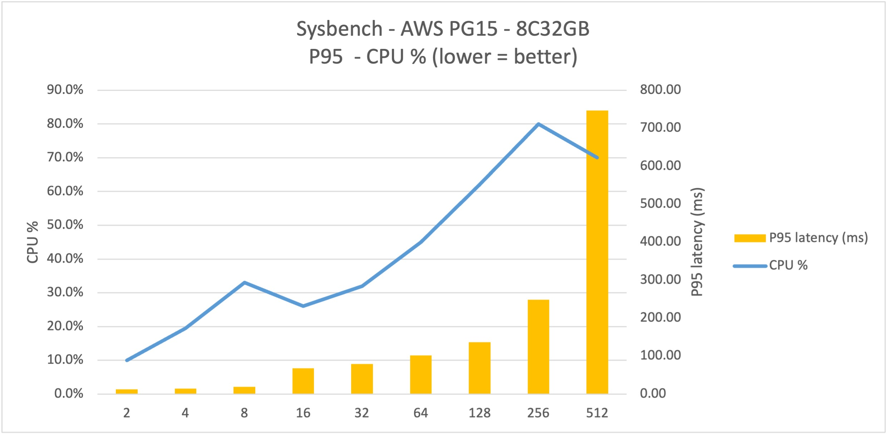

# Sysbench on AWS Cloud

## Systems

### 0. A picture worth 1000 words
1. **8C32GB PG15** on AWS's Virginian region can scale concurrency up to **128** threads with stability
2. Further stress to 256 significant increases latency by **78%** with limited gain on throughput of **16%**, with 512 threads will gain no throughput(comparing to the 128) with 5X latency. 
3. With fully utilized at thread 128, the PG instance can produce **~1400 tps** and **1.8 tps/monthcost$** (month cost = monthly cost of this instance in term of US $)
4. In the follow up study, by paying more IOPS(double from 2K to 4K), TPS increases and TPS/monthlycost improved by 40~60% at 16/32/64 thds(the following charts were drawing with 2000 IOPS setting) 

### 1. VM Spec and cost

| Name             | Value |Cost (monthly) |
| :---------------- | :------: |:------: |
| machine Type        | t3.xlarge   t3 4vCPU 16Gib, current generation   |
| CPU/Memory |        4vCPU 16Gib   |  ($0.1664/Hour)$119.80 *
| Storage           |  gp2 SSD  50GiB  | NaN (couldn't figure out)
| OS        | Amazon Linux 2 Kernel 5.10 AMI 2.0.20240109.0 x86_64   |
| region/zone        | us-east-1a (N. Virginia)  |
| total || $119.80/month 

* This test picks the lower price tags. Other options include: on-demand RHEL $0.2264/h, On-Demand SUSE $0.2227/h, On-Demand Linux base pricing: $0.1664/hour, On-Demand Windows $0.24/h

### 2. PostgreSQL 15

Major resource 

| Name             | Value |Cost (monthly) |
| :---------------- | :------: |:------: |
| Instant Type  | db.m5.2xlarge  | 
| DB Version        | PG15   |
| CPU/Mem |        8vCPUs 32 Gib   am network: 4750 Mbps  |  single DB $519.76/m *#
|Total Cost|| **$751.01/month** |

* Unlike on other clouds, I decide to choose single DB instead of HA(m-s). Otherwise, the monthly cost of DB will double and total cost will far exceed budget for meaningful comparison.

# AWS explicitly charges IOPS , so only $200 was used from the budget to provision IOPS. However, this may cause IO become bottleneck before better leverage other resource, and may partially explain AWS' underperformance

Other Spec 

| Name             | Value | 
| :---------------- | :------: |
| Billing Method | Pay-as-you-go
| Region  | us-east-1a (N. Virginia) 
| Edition | PostgreSQL  15.4
| HA | No
| Storage Type | Provisioned IOPS SSD (io1) 2000 IOPS 
| Zone | us-east-1a
| Instance Type | 8 Cores 32G(General-purpose)
| Storage Capacity |  250GB
| Backup | Enabled (7 days)

### 3. Sysbench Result

Seven 10-minutes run of oltp_read_write with with different # of concurrent threads, with the focus on TPS, QPS, P95 latency and the CPU usage of the cloud database.

#### PG15: 8 Cores 32G

| Thread | TPS     | QPS      | P95 latency (ms) | CPU % | TPS/m$ * |
| ------ | ------- | -------- | ---------------- | ----- | ------ |
| 2      | 244.96  | 4899.12  | 11.96            | 10.0% | 0.326  |
| 4      | 445.22  | 8904.41  | 14.22            | 19.5% | 0.593  |
| 8      | 739.99  | 14799.78 | 19.00            | 33.0% | 0.985  |
| 16     | 661.48  | 13229.63 | 68.16            | 26.0% | 0.881  |
| 32     | 825.02  | 16500.37 | 79.42            | 32.0% | 1.099  |
| 64     | 958.75  | 19175.53 | 102.15           | 45.0% | 1.277  |
| 128    | 1396.26 | 27926.19 | 136.17           | 62.0% | 1.859  |
| 256    | 1543.42 | 30871.73 | 248.83           | 80.0% | 2.055  |
| 512    | 1325.27 | 26507.87 | 746.32           | 70.0% | 1.765  |

* Normalized by monthly cost of $751.01

#### Conclusion

1. PG15 operates well with lower concurrent threads, and fairly stable at the 64 and 128. 
2. Linearity fair well till concurrency reach 128. Between 128 to 256, TPS raises with much higher cost of  latency.  
3. Normalized by non-discounted cost of $751.01, the 1.859 TPS/dollar-month is only half of GCP Cloud PostgreSQL(3.19~3.62TPS/dollar-month). And this is a single-DB cost on AWS without HA (same as GCP).  
4. Considering both GCP and AWS are matured US-Based Cloud provider. The TPS/dollar-month points to the no-brainer decision : GCP.

#### Follow up study

Because AWS' performance was surprisingly low comparing all four other clouds, I have been looking for reasonable explanation. One suggestion is  that the system reaches bottleneck at IO before following utilizing other resource such as CPU. Hence, this follow up study.

1. AWS PG15 spec.

	Double **IOPS to 4000** with all other spec stay same, with roughly 26.7% increase of monthly cost.

	| Name             | Value |Cost (monthly) |
	| :---------------- | :------: |:------: |
	| Instant Type  | db.m5.2xlarge  | 
	| DB Version        | PG15   |
	| CPU/Mem |        8vCPUs 32 Gib   am network: 4750 Mbps  |  single DB $519.76/m *#
	|Total Cost|| **$951.01/month** |

2.  Sysbench result PG15: 8 Cores 32G 4000IOPS

	| Thread | TPS     | P95 latency (ms) | CPU % | TPS/m$     | Comp with 2K IOPS |
	| ------ | ------- | ---------------- | ----- | ---------- | ----------------- |
	| 2      | 278.40  | 10.27            | 9.50% | 0.2927414  | \-10.2%           |
	| 4      | 501.73  | 11.65            | 18%   | 0.52757595 | \-11.0%           |
	| 8      | 851.54  | 14.21            | 35%   | 0.89540594 | \-9.1%            |
	| 16     | 1367.1  | 18.61            | 65%   | 1.43752432 | 63.2%             |
	| 32     | 1601.85 | 39.65            | 81%   | 1.68436715 | 53.3%             |
	| 64     | 1720.93 | 61.08            | 85%   | 1.80958139 | 41.7%             |
	| 128    | 1885.83 | 106.75           | 97%   | 1.98297599 | 6.7%              	|
	| 256    | 1906.75 | 223.34           | 94%   | 2.00497366 | \-2.4%            |
	| 512    | 1467    | 601.29           | 89%   | 1.54257053 | \-12.6%           |

3. Conclusion from follow up study

	With more IP, the TPS/throughput indeed increased.  At full full throttle(i.e. sweat spot) of 16/32/64 thds, the correspondent TPS/m$ raise 40~60%.  

Please ref the [raw result](./sysBench_result_AWS8C32GB4000iops) and [CPU utility](./AWS_PG15_8C32GB4000ipos_CPU.jpg) for detail