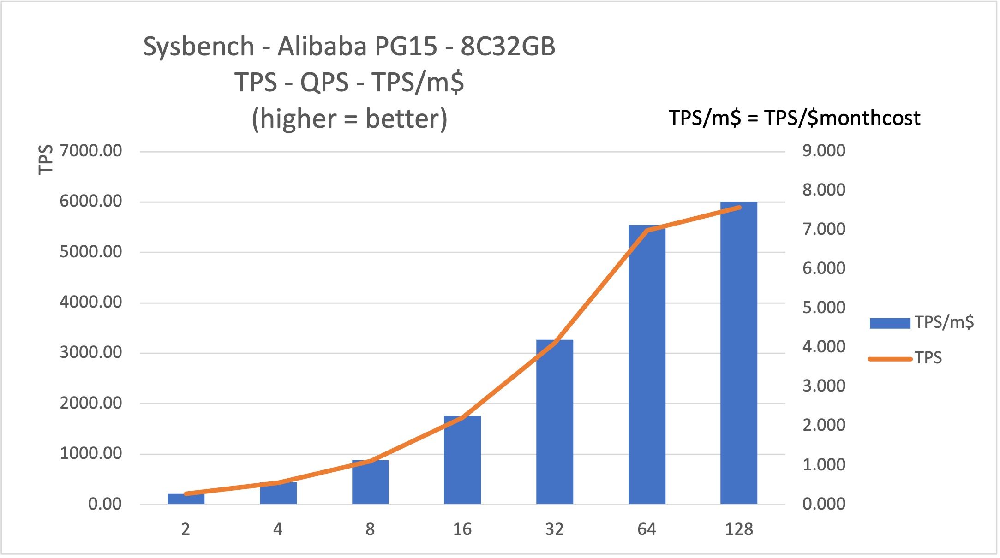
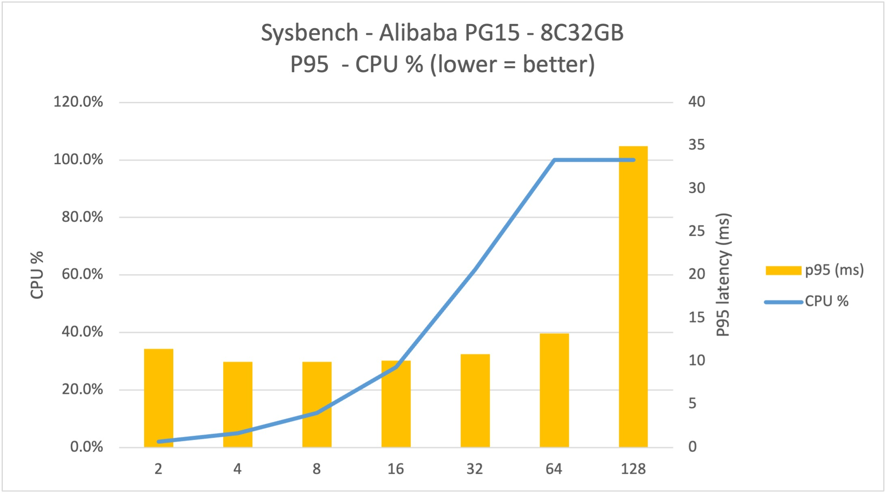

# Sysbench on Alibaba Cloud

## Systems

### 0. A picture worth 1000 words
1. **8C32GB PG15** on Alibaba's Virginian region can scale concurrency up to **64** threads with stability
2. Further stress to 128 significant increases latency by **2.5X** with limited gain on throughput
3. When fully utilized, the PG instance can reach **~5500 tps** and **7+ tps/monthcost$** (month cost = monthly cost of this instance in term of US $)

### 1. VM Spec and cost

| Name             | Value |Cost (monthly) |
| :---------------- | :------: |:------: |
| machine Type        | ecs.c7.xlarge   x86-Compute-optimized (Intel)   |
| CPU/Memory |        4 vCPU  8 GB   |  (￥1.0660/Hour)$106.45 *
| Storage           |   Enhanced SSD (ESSD) 50GiB    PL0 (up to 10,000 IOPS per disk) | (￥0.0825/Hour) $8.24
| OS        | CentOS 8.5 64-bit(Security Hardened)  |
| region/zone        | Virginia Zone B  |
| total || $114.69/month **

* CNY:USD = ￥7.21 : $1

** At the time of testing, Alibaba Cloud offers discount at 78%, so the actual cost is $89.46. 

### 2. PostgreSQL 15

Major resource 

| Name             | Value |Cost (monthly) |
| :---------------- | :------: |:------: |
| Instant Type  | pg.n4.8c.2m  | 
| DB Version        | PG15   |
| CPU |        8 vCPU 32 GB    |  (￥6.311/Hour) $630.22
| Storage           |  250 GiB SSD | (￥1.331/Hour) $132.92
| total || ￥7.64/hour #
|Total Cost|| **$762.93/month** |

# At the time of testing, Alibaba Cloud offers discount at 78%, so the actual cost is ￥5.96/hour, $595.09/month 

Other Spec 

| Name             | Value | 
| :---------------- | :------: |
| Billing Method | Pay-as-you-go
| Region US (Virginia) 
| Edition | PostgreSQL  15.0
| HA | High-availability Edition (same zone)
| Storage Type | PL1 ESSD 
| Zone | Virginia Zone B(Primary)+ Automatically Allocated(Secondary)
| Instance Type | 8 Cores 32G(General-purpose)
| Connections | 3200
| Max IOPS | 14300
| Storage Capacity |  250GB
| Backup | Free of Charge Within 500 G 

### 3. Sysbench Result

Seven 10-minutes run of oltp_read_write with with different # of concurrent threads, with the focus on TPS, QPS, P95 latency and the CPU usage of the cloud database.

#### PG15: 8 Cores 32G(General-purpose)

| Thread | TPS     | QPS       | P95 latency (ms) | CPU % # | TPS/$ * |
| ------ | ------- | --------- | ---------------- | ------ | ----- |
| 2      | 212.86  | 4257.27   | 11.45            | 2.0%   | 0.279 |
| 4      | 437.77  | 8755.37   | 9.91             | 5.0%   | 0.574 |
| 8      | 869.43  | 17388.61  | 9.91             | 12.0%  | 1.140 |
| 16     | 1726.85 | 34537.03  | 10.09            | 28.0%  | 2.263 |
| 32     | 3204.61 | 64092.35  | 10.84            | 62.0%  | 4.200 |
| 64     | 5440.64 | 108813.38 | 13.22            | 100.0% | 7.131 |
| 128    | 5892.50 | 117851.37 | 34.95            | 100.0% | 7.724 |

# postgresql.cpu_usage

* Normalized by monthly cost of $762.93

#### Conclusion

1. PG15 operates well with lower concurrent threads, and both reach 100% CPU capacity(attn: postgresql.cpu_usage)  at 64 threads. 
2. Linearity fair well till concurrency reach 64. Between 64 and 128 TPS and QPS raise <10% with latency more than doubled. 
3. Normalized by non-discounted cost, the 7+ TPS/dollar-month is doubled of GCP Cloud PostgreSQL(3.19~3.62TPS/dollar-month). 
