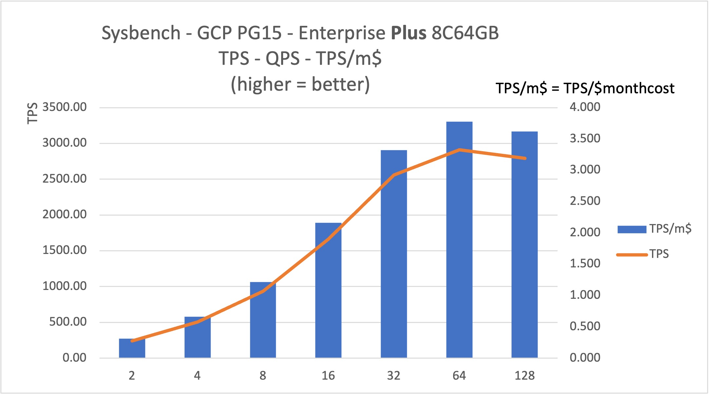
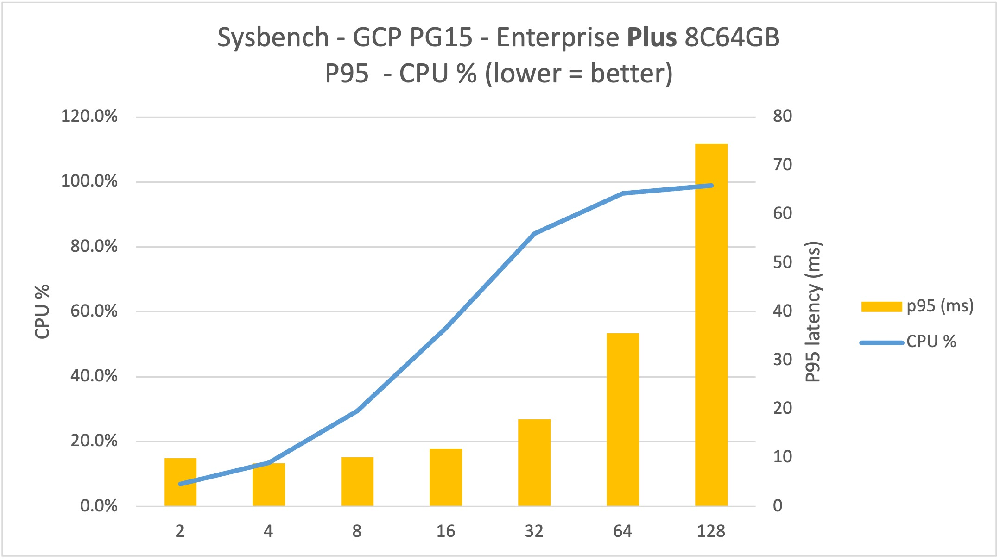

# Sysbench on Google Cloud

## Systems

### 0. A picture worth 1000 words
1. **8C64GB PG15 Enterprise Plus** on GCP's Iowa region can scale concurrency up to **64** threads with stability
2. Further stress to 128 theads, will see TPS decrease while P95 latency more than doubled. 
3. With fully utilized at thread 64 and 128, the PG instance can produce 2700 and 2900 tps with roughly 3.7 tps/monthcost$ (month cost = monthly cost of this instance in term of US $)

### 1. VM Spec and cost

| Name             | Value |Cost (monthly) |
| :---------------- | :------: |:------: |
| machine Type        | c3-highcpu-4   |
| CPU/Memory |        4 vCPU  8 GB   |  $125.83
| Storage           |   50 GB SSD persistent disk   | $8.50
| OS        | centos stream 9   |
| region/zone        | us-central1-c   |
| availability policy | standard |

Total Cost: $134.33/month

### 2. PostgreSQL

#### PG15 - Enterprise

Major resource 

| Name             | Value |Cost (monthly) |
| :---------------- | :------: |:------: |
| Cloud SQL Edition | Enterprise  | 
| DB Version        | PG15   |
| CPU |        8 vCPU    |  ($0.041 per vCPU/hour) $0.33
| Memory |       32 GB   | ($0.007 per GiB/hour) $0.22	
| Storage           |  250 GiB SSD | ($0.17 per GiB/month) $0.06
| total || $0.61/hour *
|Total Cost|| **$439.2/month** |

* Multi-zone HA will cost $1.23 per hour($885.6/m)

Other Spec 

| Name             | Value | 
| :---------------- | :------: |
| region/zone        | us-central1-c   |
|Data Cache | Disabled
|Connections| Private IP/ Public IP
|Backup| Automated
|Availability| Single zone
|Point-in-time recovery| Enabled
|Network throughput (MB/s) | 2,000 of 2,000
|Disk throughput (MB/s) | Read: 120.0 of 800.0   Write: 120.0 of 800.0
|IOPS | Read: 7,500 of 15,000   Write: 7,500 of 15,000

#### PG15 - Enterprise Plus

Major resource 

| Name             | Value |Cost (hourly) |
| :---------------- | :------: | :------: |
| Cloud SQL Edition | Enterprise Plus | | 
| CPU |        8 vCPU    |  ($0.054 per vCPU/hour) $0.43
| Memory |       64 GB   | ($0.009 per GiB/hour) $0.58	
| Storage           |  250 GiB SSD | ($0.17 per GiB/month) $0.06
| total || $1.07/hour
|Total Cost|| **$770.4/month**   (hypothetically with 32GB, $561.6/month) |

* Multi-zone HA will cost $2.14/hour

Other Spec 

| Name             | Value | 
| :---------------- | :------: |
| Version        | PG15   |
| region/zone        | us-central1  |
|Data Cache | Disabled
|Connections| Private IP/ Public IP
|Backup| Automated
|Availability| Single zone
|Point-in-time recovery| Enabled
|Network throughput (MB/s) | 2,000 of 2,000
|Disk throughput (MB/s) | Read: 120.0 of 800.0   Write: 120.0 of 800.0
|IOPS | Read: 7,500 of 15,000   Write: 7,500 of 15,000

### 3. Sysbench Result

Seven 10-minutes run of oltp_read_write with with different # of concurrent threads, with the focus on TPS, QPS, P95 latency and the CPU usage of the cloud database.

#### PG15 Enterprise

| Thread | TPS     | QPS      | P95 latency (ms) | CPU %  | TPS/$ \* |
| ------ | ------- | -------- | ---------------- | ------ | -------- |
| 2      | 141.43  | 2828.52  | 16.71            | 9%     | 0.322    |
| 4      | 285.43  | 5708.57  | 16.71            | 16.50% | 0.650    |
| 8      | 521.17  | 10423.31 | 19.65            | 31%    | 1.187    |
| 16     | 871.83  | 17436.91 | 24.83            | 53.50% | 1.985    |
| 32     | 1293.66 | 25873.53 | 36.89            | 82.50% | 2.945    |
| 64     | 1443.26 | 28865.49 | 81.48            | 93%    | 3.286    |
| 128    | 1401    | 28020.81 | 173.58           | 91%    | 3.190    |

\* Normalized by monthly cost of $439.2

#### PG15 Enterprise Plus

| Thread | TPS     | QPS      | P95 latency (ms) | CPU % | TPS/$ \* |
| ------ | ------- | -------- | ---------------- | ----- | ----- |
| 2      | 240.90  | 4818.05  | 9.91             | 7.0%  | 0.313 |
| 4      | 508.23  | 10164.69 | 8.9              | 13.5% | 0.660 |
| 8      | 935.88  | 18717.69 | 10.09            | 29.5% | 1.215 |
| 16     | 1664.64 | 33292.82 | 11.87            | 55.0% | 2.161 |
| 32     | 2559.39 | 51188.22 | 17.95            | 84.0% | 3.322 |
| 64     | 2910.95 | 58219.83 | 35.59            | 96.5% | 3.778 |
| 128    | 2790.33 | 55807.38 | 74.46            | 98.9% | 3.622 |

\* Normalized by monthly cost of $770.4

#### Conclusion

1. Both versions of PG15 operate well with lower concurrent threads, and both reach 80+ CPU capacity at 32 threads. 
2. Both begin to lose linearity between 32 and 64, and degradation between 64 and 128 particularly in term of latency 
3. Enterprise Plus indeed performs significant between with both higher TPS and QPS under same concurrency, and higher performance ceiling
4. Even normalized by cost, enterprise Plus shows slights better dollar return in high concurrent situation. Keep in mind, the instance of enterprise Plus carries 64 GB instead 32 GB of enterprise instance because GCP does not offer the lower memory option, however 32GB should be sufficient for this comparison 