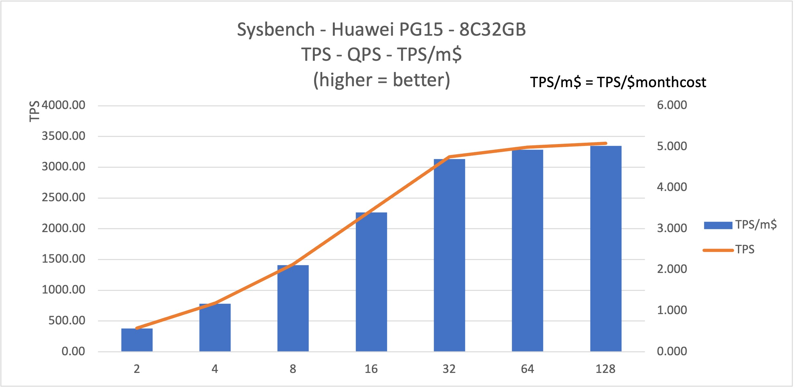

# Sysbench on Huawei Cloud

## Systems

### 0. A picture worth 1000 words
1. **8C32GB PG15** on Huawei's Mexico City region can scale concurrency up to **32**  threads (comparing to 64 of other Cloud provides) with stability
2. Further stress to 64 significant increases latency by **120%** with limited gain on throughput of **5%**, with 128 thd gain merely 6.8%* (comparing to 64 the) with with 4.4X latency. 
3. After pushing to 128 threads, the PG instance can produce **~3400 tps** and **5.0 tps/monthcost$** (month cost = monthly cost of this instance in term of US $)
4. As one might notices, the report doesn't contain CPU utilization. After **3+ hours** spending on the website with authorization and permission, I cannot figure out how to get the monitor/performance information. Before self-blame, I realized that on the other four clouds(GCP, AWS, Ali, Tencent) only 5 minutes(more accurately, 10 seconds) was necessary. 

### 1. VM Spec and cost

| Name             | Value |Cost (monthly) |
| :---------------- | :------: |:------: |
| machine Type        | c6s.xlarge.2: X86 |
| CPU/Memory |        4vcpu 8GB   |  (¥0.96/hour) $95.87/month *
| Storage           |  General Purpose SSD: 50GB   IOPS limit: 2,400   IOPS burst limit: 8,000 | (¥0.05/hour) $4.99/month 
| OS        | Centos 8.2 64bit   |
| EIP | Dynamic BGP EIP (bandwidth: 1Mbit/s) **   |  (¥0.0384/hour) $27.65/month
| region/zone        | LA-Mexico City 1 *** |
| total || $128.51/month 

* RMB: USD = ¥7.21: $1
** By default, External IP is off with no cost. Without EIP, no internet connection is available. Also, because the browser based ssh interface is too slow and lack of functionality such as easy copy/paste or download files. Therefor, I choose to enable EIP. There is also a bandwidth cost, but I didn't figure out how it is calculated. So the total cost may be revised later. Good news: VM cost wasn't factored in this sysbench report
*** Huawei Cloud does not have region setup in U.S.

### 2. PostgreSQL 15

Major resource 

| Name             | Value |Cost (monthly) |
| :---------------- | :------: |:------: |
| Instant Type  | rds.pg.n1.2xlarge.4.ha  | 
| DB Version        | PG15   |
| CPU/Mem |        8 vCPUs, 32 GB (General-purpose)   Recommended Connections: 3,200  |  Same-AZ HA ￥5.84/h, $583.19/m *
| Storage           |  250 GiB Cloud SSD  |  ￥0.92/h, $91.87/m
|Total Cost|| ￥6.76/h,  **$675.06/month** |

* RMB: USD = ¥7.21: $1

Other Spec 

| Name             | Value | 
| :---------------- | :------: |
| Billing Method | Pay-per-use
| Region  | LA-Mexico City1 
| Edition | PostgreSQL  15
| HA | Same AZ Primary-Standby
| Storage Type | Cloud SSD

### 3. Sysbench Result

Seven 10-minutes run of oltp_read_write with with different # of concurrent threads, with the focus on TPS, QPS, P95 latency and the CPU usage of the cloud database.

#### PG15: 8 Cores 32G

| Thread | TPS     | QPS      | P95 latency (ms) | CPU % | TPS/m$ *|
| ------ | ------- | -------- | ---------------- | ----- | ------ |
| 2      | 386.99  | 7739.65  | 7.34             | NaN   | 0.573  |
| 4      | 793.30  | 15865.96 | 7.17             |       | 1.175  |
| 8      | 1424.76 | 27995.23 | 8.37             |       | 2.111  |
| 16     | 2296.64 | 45932.94 | 10.40            |       | 3.402  |
| 32     | 3172.38 | 63448.04 | 15.70            |       | 4.699  |
| 64     | 3328.92 | 66579.24 | 34.34            |       | 4.931  |
| 128    | 3388.67 | 67775.18 | 69.57            |       | 5.020  |

* Normalized by monthly cost of $675.06

#### Conclusion

1. **Concurrency only reach 32** before flatted curve appears with 64 and 128. The is quite low comparing to other providers which can reach at least 64
2. With 32 threads, TPS can reach **3000+** with P95 latency 15.79ms. Both numbers are not bad.
3. Normalized by non-discounted cost of $675.06, with **4.7 TPS/month-cost**, which is 2.5X of AWS, and 30~50% higher than GCP. Nice bargain compares AWS and GCP, particular with a HA(of same AZ) setup 
4. Huawei Cloud's largest drawback: **no monitor/performance metric**. To be fair, I believe Huawei Cloud has such feature(cannot image otherwise). It is just too hard to figure out. A car without speedometer is not drivable. Another minor issue surrounding the unmatured offering is that some key menu items is Chinese even after switch to English setting. 
