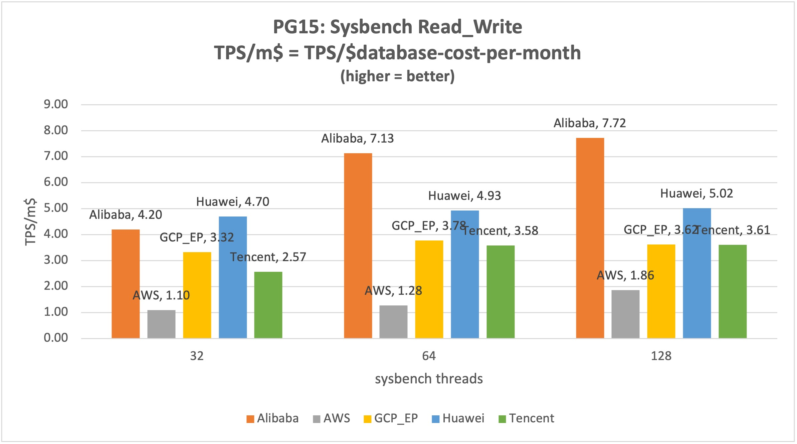

# Pick the right PostgreSQL on five clouds  in U.S region

## A cost-efficient analysis using sysbench on PostgreSQL 15 on Alibaba, AWS, GCP, Huawei and Tencent


This exercise will leverage the multi-threaded benchmark too, [sysbench](https://github.com/akopytov/sysbench), to evaluate managed database on all major cloud provides, including GCP, AWS, AlibabaCloud, Huawei Cloud and Tencent Cloud. 

By conducting a more systematic performance comparison of various cloud database vendors, the goal is to serve as a reference for developers and enterprises when selecting cloud databases. 

The initial stage will use sysbench *oltp_read_write* benchmark for PostgreSQL.


## I. Environment

### Hardware resource
A compute engine(such as AWS's EC2 and GCP's VM) and a cloud database(such as AWS's RDS-PG and GCP's Cloud SQL-PG) will be allocated within **the same region, and same available-zone** to minimize the network issue.

The exercise chooses the **entry/mid-level enterprise** Both compute engine and database, so that the resource would be power enough for an enterprise workshop, but also not too high so anyone can reproduce the exercise with minimal cost or free credit from the cloud provider. With that, the compute engine will cost $100-200/month, the Database will cost $500-800/month before any discount. The spec of each resource will be listed in the detail reports. 


## II. Sysbench

* Version: sysbench 1.0.xx 

### Step 1:  create Database

```
$ psql -h $dbip -p $dbport  -U $dbuser -W -c "CREATE DATABASE t_sysbench";
```

### Step 2: prepare Data: 10 tables, each with 10M rows

```
sysbench --db-driver=pgsql --pgsql-host="$dbip" --pgsql-port="$dbport" --pgsql-user="$dbuser" --pgsql-password="$pw"  --pgsql-db=t_sysbench --table_size=10000000 --tables=10 --events=0 --time=600  --threads=$i --percentile=95 --report-interval=60 oltp_read_write prepare
```

### III. Runs

Seven 10-minutes run of oltp_read_write with with different # of concurrent threads, with the focus on TPS, QPS, P95 latency and the CPU usage of the cloud database.

| Name             | Value |
| :---------------- | :------: | 
| scenario        |  oltp\_read\_write   | 
| concurrent threads        |  2,4,8,16,32,64,128   |
| latency           |   P95   |  
| cycle           |   600s   |  
| tables | 10   | 
| table size | 10,000,000   | 


```
#!/bin/bash

# Pls modify accordingly
ofile="sysBench_result"
dbip="1.0.0.0"
dbport="5432"
dbuser="postgres"
pw="notGoingToTellyou"

for ((i=2; i<=128; i=i*2)) 
do 
	echo "Thread = $i"
	echo "######----- $(date) -----######" &>> "$ofile"
	echo "Thread = $i" &>> "$ofile"
	sysbench --db-driver=pgsql --pgsql-host="$dbip" --pgsql-port="$dbport" --pgsql-user="$dbuser" --pgsql-password="$pw"  --pgsql-db=t_sysbench --table_size=10000000 --tables=10 --events=0 --time=600  --threads=$i --percentile=95 --report-interval=60 oltp_read_write run &>> "$ofile"
done
```

## IV. Comparable Report 

### Five Clouds 
|                 | Alibaba       | AWS                      | GCP_EP               | Huawei          | Tencent       |
| --------------- | ------------- | ------------------------ | -------------------- | --------------- | ------------- |
| Monthly Cost($) | 762.93        | 751.01                   | 770.40               | 675.06          | 826.85        |
| Region          | US (Virginia) | us-east-1a (N. Virginia) | us-central1-c (Iowa) | LA-Mexico City1 | US (Virginia) |
| HA | Enable(same zone) | No | No | Enable(same zone) | Enable(same zone)

### TPS

| TPS/Threads | 2      | 4      | 8       | 16      | 32      | 64      | 128     |
| ----------- | ------ | ------ | ------- | ------- | ------- | ------- | ------- |
| Alibaba     | 212.86 | 437.77 | 869.43  | 1726.85 | 3204.61 | 5440.64 | 5892.50 |
| AWS         | 244.96 | 445.22 | 739.99  | 661.48  | 825.02  | 958.75  | 1396.26 |
| GCP_EP      | 240.90 | 508.23 | 935.88  | 1664.64 | 2559.39 | 2910.95 | 2790.33 |
| Huawei      | 386.99 | 793.30 | 1424.76 | 2296.64 | 3172.38 | 3328.92 | 3388.67 |
| Tencent     | 219.97 | 373.31 | 714.87  | 1326.32 | 2127.34 | 2964.04 | 2982.50 |


### TPS/month-cost 

| TPS/m$  | 2    | 4    | 8    | 16   | 32   | 64   | 128  |
| ------- | ---- | ---- | ---- | ---- | ---- | ---- | ---- |
| Alibaba | 0.28 | 0.57 | 1.14 | 2.26 | 4.20 | 7.13 | 7.72 |
| AWS     | 0.33 | 0.59 | 0.99 | 0.88 | 1.10 | 1.28 | 1.86 |
| GCP_EP  | 0.31 | 0.66 | 1.21 | 2.16 | 3.32 | 3.78 | 3.62 |
| Huawei  | 0.57 | 1.18 | 2.11 | 3.40 | 4.70 | 4.93 | 5.02 |
| Tencent | 0.27 | 0.45 | 0.86 | 1.60 | 2.57 | 3.58 | 3.61 |
 



### P95 Latency

| Latency P95(ms) | 2     | 4     | 8     | 16    | 32    | 64     | 128    |
| --------------- | ----- | ----- | ----- | ----- | ----- | ------ | ------ |
| Alibaba         | 11.45 | 9.91  | 9.91  | 10.09 | 10.84 | 13.22  | 34.95  |
| AWS             | 11.96 | 14.22 | 19.00 | 68.16 | 79.42 | 102.15 | 136.17 |
| GCP_EP          | 9.91  | 8.90  | 10.09 | 11.87 | 17.95 | 35.59  | 74.46  |
| Huawei          | 7.34  | 7.17  | 8.37  | 10.40 | 15.70 | 34.34  | 69.57  |
| Tencent         | 10.27 | 12.75 | 13.46 | 18.95 | 29.19 | 44.17  | 80.76  |


### Detail reports

* [Alibaba Cloud](./AliCloud/Ali_PG15_Sysbench.md) 
* [AWS](./AWS/AWS_PG15_Sysbench.md)
* [Google Cloud](./GCP/GCP_PG15_Sysbench.md)
* [Huawei Cloud](./HuaweiCloud/Huawei_PG15_Sysbench.md)
* [Tencent](./Tencent/Tencent_PG15_Sysbench.md)

## 4. Other notes

### Cost

This exercise will also consider cost of the resource as one of the key factors, and will use the pay-as-you-go model for comparison cross cloud providers. However, some providers carry discounted price. For example, 
At the time of testing, Alibaba Cloud offers discount at 78% for its ECS, so that the list price is 114.69/month but the real cost for this exercise is $89.46. 

It is debatable whether to use cost with or without discount for later comparison. On one hand, Alibaba always carries some kind of discount both for pay-as-you-go(in this case) and subscription by month or years, so discounted price is indeed normal price; on another hand, there is no guarantee of the term of the discounted price for pay-as-you-go. Because this exercise is to provide a guideline for performance and business planning, the full price is used to avoid un-planned cost spike. 

Also because some of the price is listed in Renminbi (CNY), a conversion rate of 7.21(CNY:USD = ￥7.21 : $1) is used so the cost will be presented in US dollar . 