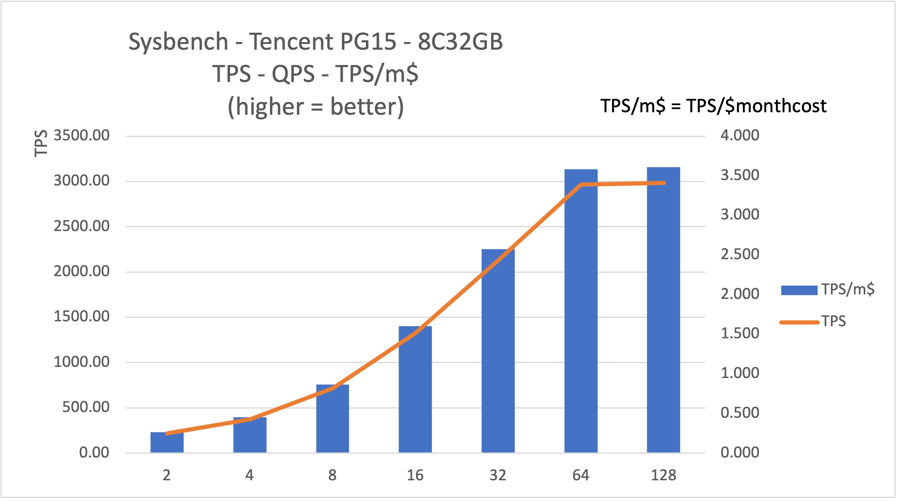
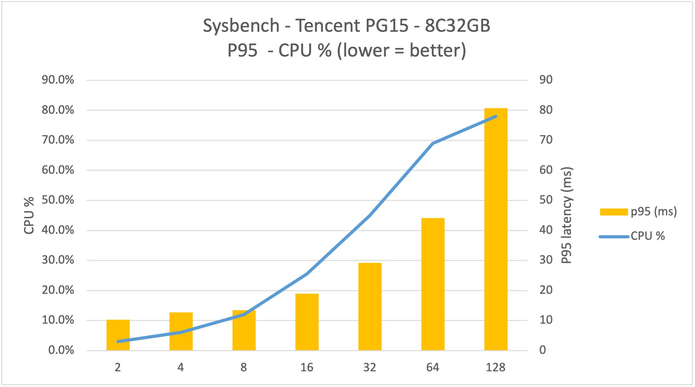

# Sysbench on Tencent Cloud

## Systems

### 0. A picture worth 1000 words
1. **8C32GB PG15** on Tencent's Virginia Zone 1 can scale concurrency up to **64**  threads (similar to most other Cloud provides) with stability.
2. When push to 128 thds almost doubles the P95 latency by **120%** without noticeable return on TPS throughput. 
3. Both 64 and 128 threads, the PG instance can produce **~3000 tps** and **3.6 tps/monthcost$** (month cost = monthly cost of this instance in term of US $)
4. A little experiments with 256 and 512 threads stress CPU to 86% and 98% result to 3X and 7X P95 latency comparing to 64 thds with 3~4% more TPS. 
5. Tencent has a unique price model for pay-on-demand, with three tier: [0,96hours],[97 hours~15 days], [15+ days], which leads the cost of PG15 instance to $1069.71/firstmonth, $826.85/followingmonth. It is debatable, and eventually decide to use **$826.85** by considering the goal to pick the right cloud PG instance for a regular business with the life expectancy of years. 
4. Deal killer: No English panel if account registered on China site. A minor complain: Could not find the stop PostgreSQL to save cost(all the other four providers have such option, though Tencent's VM also provides the option.

 

### 1. VM Spec and cost

| Name             | Value |Cost (monthly) |
| :---------------- | :------: |:------: |
| machine Type        | S2.LARGE8   Intel Xeon E5-2680 v4(2.4 GHz) |
| CPU/Memory |        4vcpu 8GB   1.5Gbps	45万PPS   |  (¥0.27/hour) $26.96/month * #
| Storage           |  Cloud SSD  50GB   IOPS: 3300; 130MiB/s | ¥0.11/hour for（0, ∞)hours, $10.98/month 
| OS        | CentOS Stream 9   |
| region/zone        | Virginian zone 1  |
| total || $37.94/month 

* RMB: USD = ¥7.21: $1

# Use the non-discounted price after 15 days **¥0.27/hour**.  Ladder price：（0, 96] hour  ¥0.62/hour( 78% discounted from ¥0.80); （96, 360] hour  ¥ 0.31(78% discount from ¥0.40); （360, ∞) hour  ¥0.21 (from 78% discount from ¥0.27).

### 2. PostgreSQL 15

* Major resource 

| Name             | Value |Cost (monthly) |
| :---------------- | :------: |:------: |
| Instant Type  | ?? | 
| DB Version        | PG v15.1_r1.8   |
| CPU/Mem |        8 vCPUs, 32 GB   |  Same-AZ HA ￥8.00/h, $798.89/m *
| Storage           |  250 GiB Local SSD (the only option)  |  ￥0.28/h, $27.96/m
|Total Cost|| ￥6.76/h,  **$826.85/month** # |

* RMB: USD = ¥7.21: $1

# Use the price after 15 days **¥8.28/hour** (including storage fee ¥0.28/hour).  Ladder price：（0, 4] day  ¥15.96/hour;  （4, 15] days  ¥ 12.12/hour; （15, ∞) days  ¥8.28/hour.

* Other Spec 

| Name             | Value | 
| :---------------- | :------: |
| Billing Method | Pay-per-use
| Region  |  Virginian zone 1
| Edition | PG v15.1_r1.8
| HA | Same AZ Primary-Standby
| Storage Type | Local SSD
| Backup | ¥0.0009/GB/hour  
| Bandwidth | free for public network(i.e. Internet) #

* Charge after exceeding the initial free portion, which is 250GB in this case.

# Implies the charge may be added in the future

### 3. Sysbench Result

Seven 10-minutes run of oltp_read_write with with different # of concurrent threads, with the focus on TPS, QPS, P95 latency and the CPU usage of the cloud database.

#### PG15: 8 Cores 32G

| Thread | TPS     | QPS       | P95 latency (ms) | CPU % | TPS/m$ |
| ------ | ------- | --------- | ---------------- | ----- | ------ |
| 2      | 219.97  | 4399.46   | 10.27            | 3.0%  | 0.266  |
| 4      | 373.31  | 7466.29   | 12.75            | 6.0%  | 0.451  |
| 8      | 714.87  | 14297.36  | 13.46            | 12.0% | 0.865  |
| 16     | 1326.32 | 26526.45  | 18.95            | 25.5% | 1.604  |
| 32     | 2127.34 | 42547.17  | 29.19            | 45.0% | 2.573  |
| 64     | 2964.04 | 59281.47  | 44.17            | 69.0% | 3.585  |
| 128    | 2982.50 | 59651.465 | 80.755           | 78.0% | 3.607  |
| 256    | 3101.73 | 62039.75  | 142.39           | 86%   | 3.751  |
| 512    | 3062.76 | 61261.2   | 303.33           | 98.0% | 3.704  |

* Normalized by monthly cost of $826.85

#### Conclusion

1. **Concurrency reach 64** before flatted curve appears between 64 and 128, though the linear begins to degrade between 32 and 65 thds.
2. With 64 threads, TPS can (almost) touch **3000+** with P95 latency 44.17ms, which are very close to the numbers from GCP Enterprise Plus.
3. Normalized by non-discounted cost of $826.85, with **3.6 TPS/month-cost**, which is 2X+ of AWS, and same with GCP-EnterpisePlus, with a HA(of same AZ) setup 
4. Huawei Cloud's largest drawback: No English language support if the account is registered in China. 
